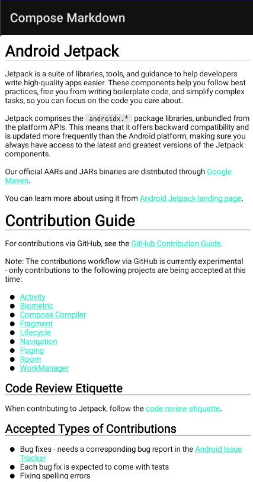

# MarkdownText - Jetpack Compose

- Markdown
- HTML
- Image
- Highlight
- Linkfy
- Table
## Setup
Configure root `build.gradle`:
```  
allprojects {  
    repositories {  
        ...  
        maven { url 'https://jitpack.io' }  
    }  
}  
```  
Add dependency into `build.gradle`:
```groovy  
dependencies {  
    implementation 'com.github.jeziellago:compose-markdown:0.1.0'  
}  
```  
## How to use
```kotlin  
val markdown = """  
	# Sample  
	* Markdown  
	* [Link](https://example.com)  
	  
	<a href="https://www.google.com/">Google</a>  
"""

@Composable  
fun ExampleContent() {  
    MarkdownText(markdown = markdownContent)  
}  
```  

# Supported attributes

Most of the attributes of that a default `Text` composable has are also supported by `MarkdownText`. 

- textColor 
- fontSize
- textAlign
- maxLines
- style (only styles for supported attributes is applied)

The font can be changed by passing a font xml resource as `fontResource` parameter. 

# License
```  
Copyright (c) 2021 Jeziel Lago  
  
Permission is hereby granted, free of charge, to any person obtaining  
a copy of this software and associated documentation files (the  
"Software"), to deal in the Software without restriction, including  
without limitation the rights to use, copy, modify, merge, publish,  
distribute, sublicense, and/or sell copies of the Software, and to  
permit persons to whom the Software is furnished to do so, subject to  
the following conditions:  
  
The above copyright notice and this permission notice shall be  
included in all copies or substantial portions of the Software.  
  
THE SOFTWARE IS PROVIDED "AS IS", WITHOUT WARRANTY OF ANY KIND,  
EXPRESS OR IMPLIED, INCLUDING BUT NOT LIMITED TO THE WARRANTIES OF  
MERCHANTABILITY, FITNESS FOR A PARTICULAR PURPOSE AND  
NONINFRINGEMENT. IN NO EVENT SHALL THE AUTHORS OR COPYRIGHT HOLDERS BE  
LIABLE FOR ANY CLAIM, DAMAGES OR OTHER LIABILITY, WHETHER IN AN ACTION  
OF CONTRACT, TORT OR OTHERWISE, ARISING FROM, OUT OF OR IN CONNECTION  
WITH THE SOFTWARE OR THE USE OR OTHER DEALINGS IN THE SOFTWARE.  
```